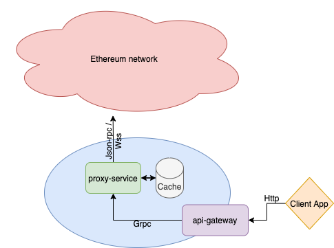

# ETH-proxy
ETH-proxy is a complex solution to make proxi-based Ethereum block explorer 
with built-in cache mechanic.

Project based on 2 microservices:
* Proxy-service with Grpc API to cooperate with other microservices
* api-gateway with REST API to cooperate with client applications

### Infrastructure scheme


## Table of Contents

- [Quick start](#quick-start)
- [Code structure](#Code-structure)
- [Make commands](#Make-commands)
- [CLI](#CLI)
- [Dependencies](#Dependencies)
- [Configuration](#Configuration)

## Quick start
You can simply run this application by using docker compose.

### Requirements
* [Docker](https://github.com/docker/cli)
* [Docker Compose](https://github.com/docker/compose)

### How to
1. clone this repo
    ```shell
    $ clone git@github.com:andskur/eth-proxy.git
    ```
2. go to the cloned directory
   ```shell
   $ cd eth-proxy
    ```
3. run services with docker-compose
   ```shell
   $ docker-compose up
    ```
4. open your browser and go to the Rest API docs - ``http://localhost:8888/api/v1/docs``
5. send http request to the Rest API
    ```shell
   $ curl  localhost:8888/api/v1/block/latest
   {"number":12562832,"hash":"0x0666df9f4a8458c0cf843c6406b1f41c56d7c233be8fdca1a1edecad2f040f90","parent":"0xa131c933e5d1e282fcc3e43980e1ec573c0eeea18e44c70a0f8b20db5f9a3501","timestamp":1622740994,"tx_count":231}
    ```

## Code structure
```
|---api - api gateway microservice
|   └---cmd - api gateway CLI commands and app entry points
|   |   └---root - root comand, app entrypoint
|   |   └---serve - command that run microservice
|   |   └---api.go - app entrypoint
|   |
|   └---config - service specific configuration
|   |   └---config.go - config scheme
|   |   └---init.go - default config initialisation
|   |
|   └---format - models to definitions formatters
|   |
|   |---handlers - rest API handlers
|   |
|   |---middlewares rest API middlewares
|   |
|   |---models auto-generated rest api models definitions
|   |
|   |---server auto-generated rest api http server and operations
|   |
|   |---application.go - main api-gatteway app structure with all initialisations
|   |
|   |---swagger.yaml - openapi 2.0 swagger specification
|
|---lib - Grp API wrapper for proxy-service
|
|---models - main models shared between services
|
|---pkg - packages shared between service
|   └---logger - logging wrapper
|   |
|   └---versioner - semver wrapper
|
|---proto - protobuff specifications and generated Go files
|
|---proxy-service - proxy microservice
|   |
|   └---cmd - proxy service CLI commands and app entry points
|   |   └---root - root comand, app entrypoint
|   |   └---serve - command that run microservice
|   |   └---proxy-service.go - app entrypoint
|   |
|   └---config - service specific configuration
|   |   └---config.go - config scheme
|   |   └---init.go - default config initialisation
|   |
|   └---repository - repository pattern interface and implementations that controls cache storage
|   |
|   └---server - Grpc server
|   |   └---handlers.go - Grpc handlers
|   |   └---server.go - Grpc server instance and initialisation
|   |
|   └---service - service business logic
|   |
|   |---application.go - main proxy-service app structure with all initialisations
| 
|---utils - helpers functions
```

## Requirements
* [Go v1.16+](https://golang.org)
* [GNU Make](https://www.gnu.org/software/make/)
* [Swagger](https://github.com/go-swagger/go-swagger)
* [Docker](https://github.com/docker/cli)

## Make commands

### main [Makefile](Makefile)
Used in an active developing process

* ```make tidy``` - add missing and remove unused modules dependencies
* ```make update``` - update dependencies
* ```make generate-api``` - generate API based on swagger specification
* ```make generate-api-docker``` - generate API with docker container
* ```make protoc``` - generate Go files from proto specification
* ```make run_service``` - run proxy-service
* ```make run_api``` - run api gateway

### proxy-service [Makefile](proxy-service/Makefile)
Used in proxy-service building process (commonly in docker container)

* ```make build``` - build proxy-service binary
* ```make clean``` - delete proxy-service binary
* ```make image``` - build proxy-service docker image and tag it with git tag or commit hash
* ```make image_latest``` - build proxy-service docker image and tag it as latest

### api-gateway [Makefile](api/Makefile)
Used in api-gateway building process (commonly in docker container)

* ```make build``` - build api gateway binary
* ```make generate-api``` - generate API based on swagger specification* ```make clean``` - delete api gateway binary
* ```make image``` - build api gateway docker image and tag it with git tag or commit hash
* ```make image_latest``` - build proxy-service docker image and tag it as latest

## CLI

### Available command
Both microservices have one command to run service:
* **serve** - run service

### Global flags
* -c, --config string;   config file path (default is ./cfg.yaml)
* --version; show app version message

## Dependencies
* [go-swagger](https://github.com/go-swagger/go-swagger) - full functionality rest api server based on swagger spec
* [go-ethereum](https://github.com/ethereum/go-ethereum) - interacting with ETHEREUM blockchain
* [go-grpc-middleware](https://github.com/grpc-ecosystem/go-grpc-middleware) - collection of grpc middleware
* [alice](https://github.com/justinas/alice) - http middlewares chain
* [logrus](https://github.com/sirupsen/logrus) - logging library
* [cobra](https://github.com/spf13/cobra)   - library for building CLI commands
* [viper](https://github.com/spf13/viper)   - configuration solution

## Configuration
Powered by [viper](https://github.com/spf13/viper) package
that allow uses different configuration formats for one scheme (env vars preferable).

### Proxy service
* **Log** - logging
    * **level** - logging level, can be **info**, **warning**, **error**, **debug**
    * *default* - info
    * *env setup* - LOG_LEVEL=
* **Grpc** - grpc server
    * **host** - grpc host to connect
        * *default* - 0.0.0.0
        * *env setup* - GRPC_HOST=
    * **port** - grpc port to connect
        * *default* - 9090
        * *env setup* - GRPC_PORT=
    * **timeout** - grpc request default timeout
        * *default* - 120s
        * *env setup* - GRPC_TIMEOUT=
* **Ethereum** - Ethereum params
    * **addr** - ethereum node address to connect
        * *default* -  https://cloudflare-eth.com
        * *env setup* - ETHEREUM_ADDR=
    * **wss** - enable wss mode that allow to listen new mining blocks
        * *default* - false
        * *env setup* - ETHEREUM_WSS
    
### API gateway
* **Log** - logging
    * **level** - logging level, can be **info**, **warning**, **error**, **debug**
    * *default* - info
    * *env setup* - LOG_LEVEL=
* **Api** - proxy-service Grpc api connection params
    * **host** - host to service
        * *default* - profile-service
        * *env setup* - API_HOST=
    * **port** - port to service
        * *default* - 9090
        * *env setup* - API_PORT=
    * **timeout** - connection timeout
        * *default* - 60s
        * *env setup* - API_TIMEOUT=
* Http - http server
    * **host** - http host to listen
        * *default* - 0.0.0.0
        * *env setup* - HTTP_HOST=
    * **port** - http port to listen
        * *default* - 8888
        * *env setup* - HTTP_PORT=
    * **timeout** - http request default timeout
        * *default* - 60s
        * *env setup* - HTTP_TIMEOUT=    